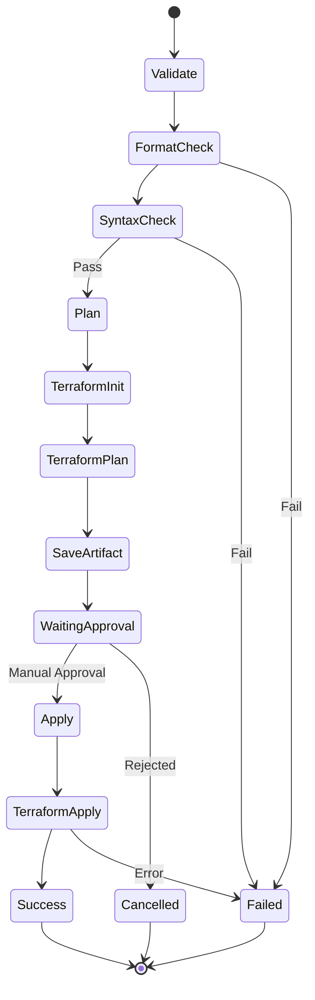
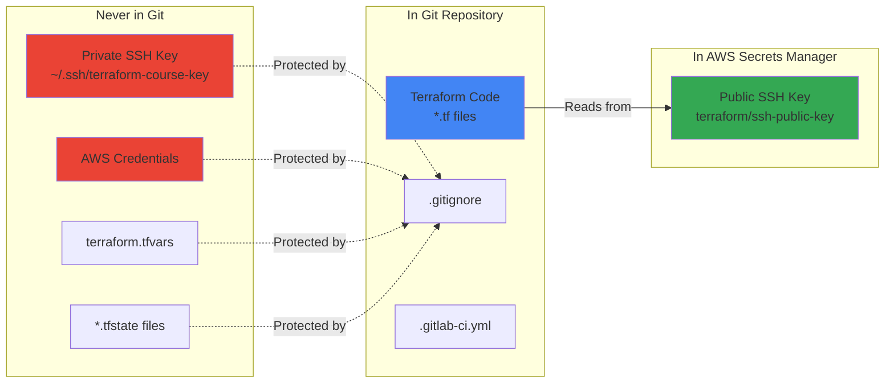
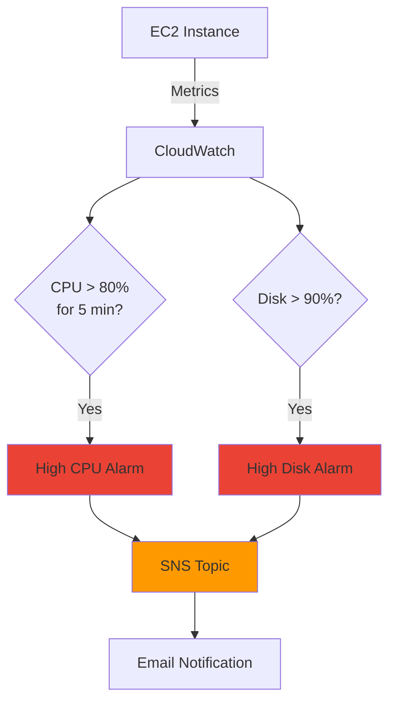

# Terraform AWS Infrastructure Project

My personal Infrastructure as Code (IaC) project for learning and deploying AWS infrastructure using Terraform with GitLab CI/CD automation.

## Table of Contents
- [Project Overview](#project-overview)
- [What This Project Does](#what-this-project-does)
- [Architecture](#architecture)
- [Project History](#project-history)
- [Current Infrastructure](#current-infrastructure)
- [Prerequisites](#prerequisites)
- [Initial Setup](#initial-setup)
- [Daily Usage](#daily-usage)
- [GitLab CI/CD Pipeline](#gitlab-cicd-pipeline)
- [Security Implementation](#security-implementation)
- [Monitoring and Observability](#monitoring-and-observability)
- [Troubleshooting](#troubleshooting)
- [Lessons Learned](#lessons-learned)
- [Future Enhancements](#future-enhancements)

---

## Project Overview

This is my learning project for mastering Terraform and AWS infrastructure automation. The project demonstrates:
- Modular Terraform architectur (test)e
- GitLab CI/CD integration
- AWS security best practices
- Infrastructure monitoring with CloudWatch
- Secrets management with AWS Secrets Manager

**GitLab Repository:** https://gitlab.com/chi0tt72-stack/terraformioctest

---

## What This Project Does

This Terraform project automatically provisions and manages:
- **Networking:** VPC, subnets, internet gateway, route tables, security groups
- **Compute:** EC2 instances with SSH access
- **Storage:** S3 buckets with encryption and versioning
- **Monitoring:** CloudWatch dashboards and alarms with SNS notifications
- **Security:** SSH keys managed via AWS Secrets Manager

All infrastructure is deployed to AWS region `us-east-1` and managed through GitLab CI/CD pipelines.

---

## Architecture

**Infrastructure Flow:**

1. **GitLab CI/CD** triggers on code push
2. **Validate Stage** checks Terraform syntax and formatting
3. **Plan Stage** generates execution plan
4. **Apply Stage** (manual approval) deploys to AWS
5. **Terraform State** stored in GitLab HTTP backend
6. **AWS Secrets Manager** provides SSH public keys
7. **CloudWatch** monitors infrastructure health

**AWS Resources Created:**
- VPC (10.0.0.0/16)
- Public subnet (10.0.1.0/24)
- Internet Gateway
- Route tables
- Security groups (SSH access on port 22)
- EC2 instance (Amazon Linux 2023, t2.micro)
- S3 bucket (encrypted, versioned)
- CloudWatch dashboard and alarms
- SNS topic for alerts

---

## Project History

### Initial Setup
- Created modular Terraform structure with separate modules for networking, compute, storage, and monitoring
- Configured GitLab CI/CD pipeline with validate, plan, and apply stages
- Set up GitLab HTTP backend for remote state management

### Security Migration (March 2026)
- **Problem:** SSH public keys were stored in GitLab CI/CD variables
- **Solution:** Migrated to AWS Secrets Manager for centralized secret management
- **Implementation:**
  - Created `terraform/ssh-public-key` secret in AWS Secrets Manager
  - Updated Terraform to read from Secrets Manager using data sources
  - Removed dependency on GitLab CI/CD variables
  - Tested end-to-end SSH connectivity

### Git Authentication Fix
- **Problem:** SSH authentication to GitLab stopped working
- **Solution:** Switched from SSH to HTTPS authentication
- **Command:** `git remote set-url origin https://gitlab.com/chi0tt72-stack/terraformioctest.git`

---

## Current Infrastructure

**Environment:** Development (dev-cursor)

**Deployed Resources:**
- 1x VPC
- 1x Public subnet
- 1x Internet Gateway
- 2x Route tables
- 2x Security groups
- 1x EC2 instance (currently running at IP: 98.81.148.21)
- 1x S3 bucket
- 1x CloudWatch dashboard
- 2x CloudWatch alarms
- 1x SNS topic

**Total AWS Resources:** ~16 resources

**Monthly Cost Estimate:** ~$10-15 (t2.micro, minimal S3 usage)

---

## Prerequisites

### Tools Required
- Terraform >= 1.0
- AWS CLI configured with my credentials
- Git
- SSH client
- GitLab account with CI/CD enabled

### AWS Account Setup
My AWS account has the following configured:
- IAM user with programmatic access
- Permissions for EC2, VPC, S3, CloudWatch, SNS, Secrets Manager
- AWS CLI configured with `aws configure`

### Local Environment
- macOS (MacBook Pro)
- SSH key pair stored at `~/.ssh/terraform-course-key`
- Git configured for HTTPS authentication to GitLab

---

## Initial Setup

This documents how I originally set up this project (for reference if I need to recreate it).

### 1. Created Project Structure

```bash
mkdir -p ~/TERRAFORM-COURSE-MYSTUDY
cd ~/TERRAFORM-COURSE-MYSTUDY

mkdir -p environments/dev
mkdir -p modules/{networking,compute,storage,monitoring}
```

### 2. Configured AWS Secrets Manager

```bash
# Generated SSH key pair
ssh-keygen -t rsa -b 4096 -f ~/.ssh/terraform-course-key -N ""
```

### Stored public key in AWS Secrets Manager

``` bash
aws secretsmanager create-secret \
  --name terraform/ssh-public-key \
  --secret-string "$(cat ~/.ssh/terraform-course-key.pub)" \
  --region us-east-1
```

### 3. Created Terraform Configuration

Created `environments/dev/terraform.tfvars`:

```hcl
project_name   = "terraform-course-cursor"
environment    = "dev-cursor"
vpc_cidr       = "10.0.0.0/16"
instance_type  = "t2.micro"
instance_count = 1
aws_region     = "us-east-1"
```

### 4. Initialized Git Repository

```bash
git init
git remote add origin https://gitlab.com/chi0tt72-stack/terraformioctest.git
git add .
git commit -m "Initial commit"
git push -u origin main
```

### 5. First Deployment

```bash
cd environments/dev
terraform init
terraform plan
terraform apply
```

## Daily Usage

### Making Infrastructure Changes

**Local workflow:**

```bash
cd ~/TERRAFORM-COURSE-MYSTUDY/environments/dev

# Make changes to .tf files

# Format code
terraform fmt

# Validate syntax
terraform validate

# Preview changes
terraform plan

# Apply locally (for testing)
terraform apply
```

### GitLab CI/CD workflow (recommended)

```bash
# Make changes to .tf files
git add .
git commit -m "feat: description of changes"
git push origin main

# Go to GitLab pipeline
# Review plan output
# Manually trigger apply stage
```

### Accessing EC2 Instance

```bash
# SSH to current instance
ssh -i ~/.ssh/terraform-course-key ec2-user@98.81.148.21

# Get current instance IP from Terraform
cd ~/TERRAFORM-COURSE-MYSTUDY/environments/dev
terraform output instance_public_ip
```

### Updating SSH Keys

```bash
# Generate new key pair
ssh-keygen -t rsa -b 4096 -f ~/.ssh/terraform-course-key -N ""

# Update AWS Secrets Manager
aws secretsmanager update-secret \
  --secret-id terraform/ssh-public-key \
  --secret-string "$(cat ~/.ssh/terraform-course-key.pub)" \
  --region us-east-1

# Delete old AWS key pair
aws ec2 delete-key-pair --key-name terraformtest-key --region us-east-1

# Trigger pipeline to recreate
git commit --allow-empty -m "chore: recreate key pair with new SSH key"
git push origin main
```

### Destroying Infrastructure

```bash
cd ~/TERRAFORM-COURSE-MYSTUDY/environments/dev
terraform destroy
```

## GitLab CI/CD Pipeline

### Pipeline Configuration

```bash 
File: .gitlab-ci.yml
```

#### Stages:

validate - Runs terraform fmt -check and terraform validate


plan - Runs terraform plan -out=plan.tfplan


apply - Runs terraform apply plan.tfplan (manual trigger required)

### Pipeline Stage Details



### Backend Configuration

Terraform state is stored remotely in GitLab HTTP backend:

- **State location:** GitLab project terraform state storage
- **State locking:** Enabled (prevents concurrent modifications)
- **State versioning:** Automatic via GitLab

### Triggering Deployments

Automatic triggers:

- **Any push to main branch triggers validate and plan stages**

Manual triggers:

- Apply stage must be manually triggered in GitLab UI
- Provides safety against accidental deployments


### Viewing Pipeline


1. Go to https://gitlab.com/chi0tt72-stack/terraformioctest
2. Click CI/CD → Pipelines
3. Click on latest pipeline
4. Review plan output
5. Click Play button on apply stage when ready

---

## Security Implementation

### Secrets Management Strategy



### What's in AWS Secrets Manager

- SSH public key (terraform/ssh-public-key)


### What's in .gitignore

- `*.tfstate` - Terraform state files
- `*.tfstate.*` - Terraform state backups
- `.terraform/` - Provider plugins
- `terraform.tfvars` - Variable values
- `*.tfvars` - All variable files

### What's NEVER committed

- AWS credentials
- SSH private keys
- Terraform state files
- Sensitive variable values

### SSH Key Management

- **Private key location:** `~/.ssh/terraform-course-key` (local only)
- **Public key location:** AWS Secrets Manager `terraform/ssh-public-key`

### How it works

- Terraform reads public key from Secrets Manager
- Creates AWS key pair with that public key
- EC2 instance launched with that key pair
- I SSH using my local private key

### Network Security

Security groups configured:

- SSH (port 22) - Restricted to my IP
- HTTPS (port 443) - For outbound updates
- HTTP (port 80) - For outbound package downloads

### S3 Bucket Security

- Server-side encryption (AES256)
- Versioning enabled
- Access logging enabled
- Public access blocked


## Monitoring and Observability

### CloudWatch Dashboard

Dashboard name: `terraform-course-cursor-dev-cursor-dashboard`
Metrics tracked:

- EC2 CPU utilization
- Network in/out
- Disk read/write operations

Access: AWS Console → CloudWatch → Dashboards

### CloudWatch Alarms



#### Configured alarms:

1. **High CPU** - Triggers when CPU > 80% for 5 minutes
2. **High Disk Usage** - Triggers when disk > 90%

**Notifications:** Sent to SNS topic (configure email subscription in AWS Console)

### Viewing Logs

```bash
# View EC2 instance logs
aws logs tail /aws/ec2/instance-logs --follow

# View CloudWatch log groups
aws logs describe-log-groups
```

---

## Troubleshooting

Common issues I've encountered and how to resolve them:

### Git Authentication Failed

**Error:** Permission denied (publickey) when pushing to GitLab

**Solution:**

```bash
git remote set-url origin https://gitlab.com/chi0tt72-stack/terraformioctest.git
git push origin main
```

### Terraform State Lock

**Error:** Error acquiring the state lock

**Cause:** Previous pipeline job didn't complete properly

**Solution:**

```bash
terraform force-unlock <LOCK_ID>
# Get LOCK_ID from error message
```

### SSH Connection Refused

**Error:** Cannot SSH to EC2 instance

**Checklist:**
- Is instance running? `aws ec2 describe-instances --instance-ids <id>`
- Is security group allowing my IP? Check AWS Console
- Am I using correct key? `ssh -i ~/.ssh/terraform-course-key`
- Is IP correct? `terraform output instance_public_ip`

**Debug command:**

```bash
ssh -v -i ~/.ssh/terraform-course-key ec2-user@<INSTANCE_IP>
```

### Pipeline Fails on Plan

**Common causes:**
- Syntax error in Terraform code
- Missing variable in terraform.tfvars
- AWS credentials expired
- Backend state locked

**Debug steps:**

```bash
cd ~/TERRAFORM-COURSE-MYSTUDY/environments/dev
terraform validate
terraform fmt -check
terraform plan
```

### Resources Already Exist

**Error:** Resource already exists when running apply

**Cause:** Destroyed infrastructure manually but state file still references it

**Solution:**
```bash
# Remove from state
terraform state rm <resource_address>

# Or refresh state
terraform refresh
```

---

## Lessons Learned

### What Worked Well

- ✅ Modular Terraform structure makes code reusable and maintainable
- ✅ GitLab CI/CD automation saves time and reduces errors
- ✅ AWS Secrets Manager provides centralized secret management
- ✅ Remote state in GitLab prevents state file conflicts
- ✅ Manual approval on apply stage prevents accidental deployments

### Challenges Overcome

- 🔧 Git SSH authentication issues → Switched to HTTPS
- 🔧 SSH key management → Migrated to Secrets Manager
- 🔧 Understanding Terraform state → Learned about remote backends
- 🔧 Pipeline debugging → Learned to read GitLab CI/CD logs
- 🔧 Nested directory issue → Removed duplicate with `rm -rf`

### Best Practices Adopted

- Always run `terraform plan` before apply
- Use `.gitignore` to protect sensitive files
- Store secrets in AWS Secrets Manager, not in code
- Use remote state with locking
- Tag all resources consistently
- Document everything in README
- Check current directory before Git commands

---

## Future Enhancements

### Planned Improvements

#### Phase 1: Foundation & Safety

- Multi-environment support (dev, staging, prod)
- Drift detection with scheduled pipelines
- Cost monitoring and budget alerts
- Automated backup strategy

#### Phase 2: High Availability & Security

- Auto-scaling groups for EC2
- Application Load Balancer (ALB)
- AWS KMS for encryption key management
- RDS database module
- Multi-AZ deployment

#### Phase 3: Advanced Features

- Automated testing with Terratest
- Disaster recovery procedures
- Blue-green deployment strategy
- Container orchestration (ECS/EKS)
- Infrastructure cost optimization

### Potential New Modules

- Load Balancer (ALB/NLB)
- Database (RDS, DynamoDB)
- CDN (CloudFront)
- DNS (Route53)
- WAF (Web Application Firewall)
- Lambda functions
- VPN Gateway
- NAT Gateway for private subnets

---

## Project Statistics

| Metric | Value |
|--------|-------|
| Created | March 2026 |
| Last Updated | March 6, 2026 |
| Total Commits | ~25+ |
| Terraform Version | 1.0+ |
| AWS Provider Version | 4.0+ |
| Lines of Terraform Code | ~500+ |
| Modules | 4 (networking, compute, storage, monitoring) |
| Environments | 1 (dev) |
| AWS Resources Managed | ~16 |

---

## Quick Reference Commands

```bash
# Navigate to project
cd ~/TERRAFORM-COURSE-MYSTUDY/environments/dev

# Terraform commands
terraform init          # Initialize Terraform
terraform fmt           # Format code
terraform validate      # Validate syntax
terraform plan          # Preview changes
terraform apply         # Apply changes
terraform destroy       # Destroy infrastructure
terraform output        # Show outputs
terraform state list    # List resources in state
terraform state show    # Show resource details

# Git commands
git status              # Check status
git add .               # Stage changes
git commit -m "msg"     # Commit changes
git push origin main    # Push to GitLab
git log --oneline -5    # View recent commits

# AWS commands
aws ec2 describe-instances                    # List EC2 instances
aws s3 ls                                     # List S3 buckets
aws secretsmanager get-secret-value \
  --secret-id terraform/ssh-public-key        # View SSH key
aws cloudwatch describe-alarms                # List CloudWatch alarms

# SSH to instance
ssh -i ~/.ssh/terraform-course-key ec2-user@<IP>

# Skip CI/CD pipeline
git commit -m "docs: update [ci skip]"
```

---

## File Structure

```
TERRAFORM-COURSE-MYSTUDY/
├── .git/                           # Git repository
├── .gitignore                      # Git ignore rules
├── .gitlab-ci.yml                  # CI/CD pipeline configuration
├── README.md                       # This file
├── environments/
│   └── dev/
│       ├── main.tf                 # Root module configuration
│       ├── variables.tf            # Variable definitions
│       ├── outputs.tf              # Output definitions
│       ├── terraform.tfvars        # Variable values (not in Git)
│       └── .terraform/             # Terraform plugins (not in Git)
└── modules/
    ├── networking/
    │   ├── main.tf                 # VPC, subnets, IGW, routes
    │   ├── variables.tf
    │   └── outputs.tf
    ├── compute/
    │   ├── main.tf                 # EC2 instances, key pairs
    │   ├── variables.tf
    │   └── outputs.tf
    ├── storage/
    │   ├── main.tf                 # S3 buckets
    │   ├── variables.tf
    │   └── outputs.tf
    └── monitoring/
        ├── main.tf                 # CloudWatch, SNS
        ├── variables.tf
        └── outputs.tf
```

---

## Notes to Self

- Always destroy resources when not in use to save costs
- Check AWS billing dashboard weekly
- Keep SSH keys backed up securely (but never in Git!)
- Review CloudWatch alarms regularly
- Update this README when making significant changes
- Test changes in dev before considering multi-environment setup
- Use `[ci skip]` in commit messages for documentation-only changes
- Verify current directory before running Git commands to avoid nested repos

---

## Resources & References

### Terraform Documentation

- https://www.terraform.io/docs

### AWS Documentation

- https://docs.aws.amazon.com/

### GitLab CI/CD

- https://docs.gitlab.com/ee/ci/

### Learning Resources

- [Terraform AWS Provider](https://registry.terraform.io/providers/hashicorp/aws/latest/docs)
- [AWS Well-Architected Framework](https://aws.amazon.com/architecture/well-architected/)
